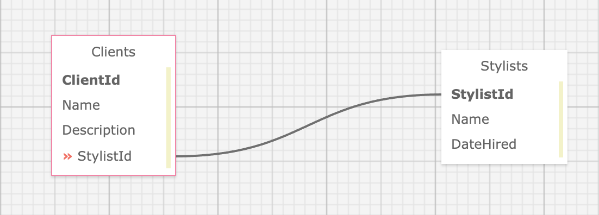

# _Eau Claire's Salon_

#### By: _**Albert Lee**_

#### _This MVC application creates a webpage that tracks Stylists and their Clients_

## Technologies Used
* C#
* ASP.NET Core MVC
* MySQL
* Entity
* NuGet
* LINQ
* Bootstrap CSS

## Description

This project is part of the Epicodus School, focusing on MVC framework and SQL databases. The user will be able to make stylists employees, create corresponding clients, and display them with Razor and HTML helpers. Databases will save data in an one-to-many relationship. 



### Setup/Installation Requirements
* Navigate to https://github.com/leesga8/HairSalon
* Click on the green "Code" button and copy URL
* Open the terminal on your desktop and navigate to `HairSalon.Solution/HairSalon` folder
* Create a file called `appsettings.json`
* Write following code with your password replacing `YOURPASSWORDHERE`
```{
    "ConnectionStrings": {
    "DefaultConnection": "Server=localhost;Port=3306;database=albert_lee;uid=root;pwd=YOURPASSWORDHERE;"
      }
    }
```
* Install .NET Framework
* Run `dotnet restore`

### Setup/Installation Database
* Open MqSql Workbench and connect to localhost:3306
* In the Navigator > Administration window, select Data Import/Restore
* In Import Options select Import from Self-Contained File
* Select albert_lee.sql
* In `Import Progress` click `Start Import`
* Run `dotnet build` and `dotnet run` in terminal

## Known Bugs

* _No known bugs_

## License

[MIT](https://opensource.org/licenses/MIT)

Copyright (c) 2021 Albert Lee

## Contact Information

Albert Lee: <leesga8@gmail.com>